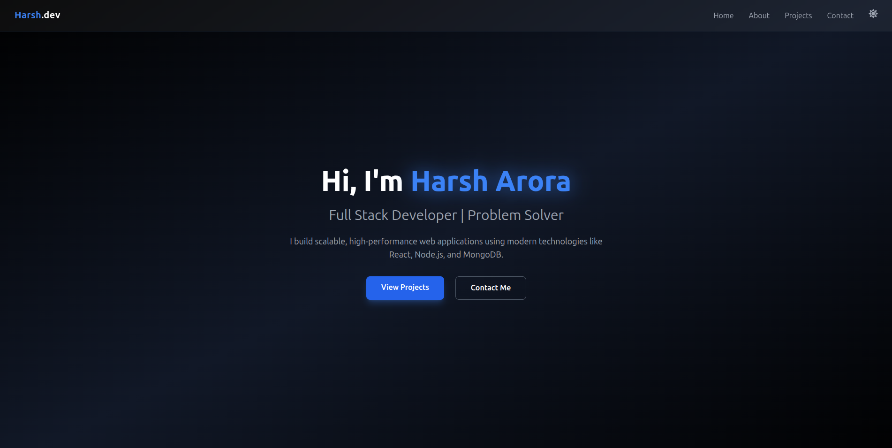
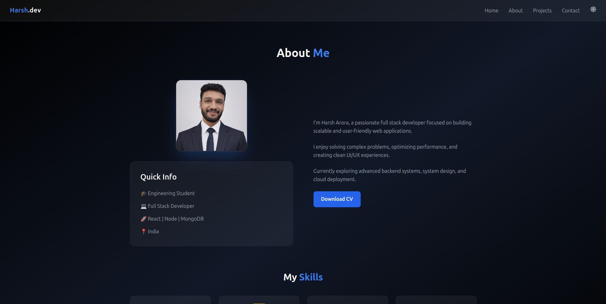
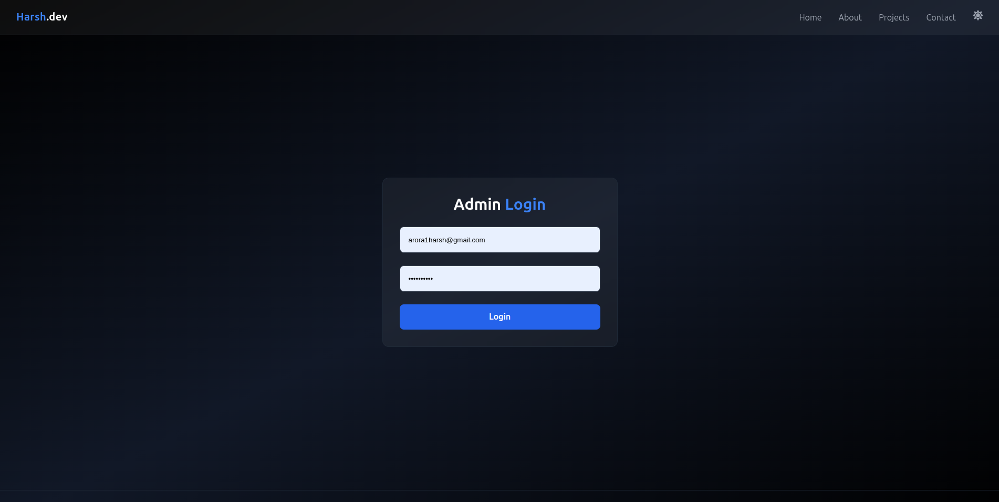
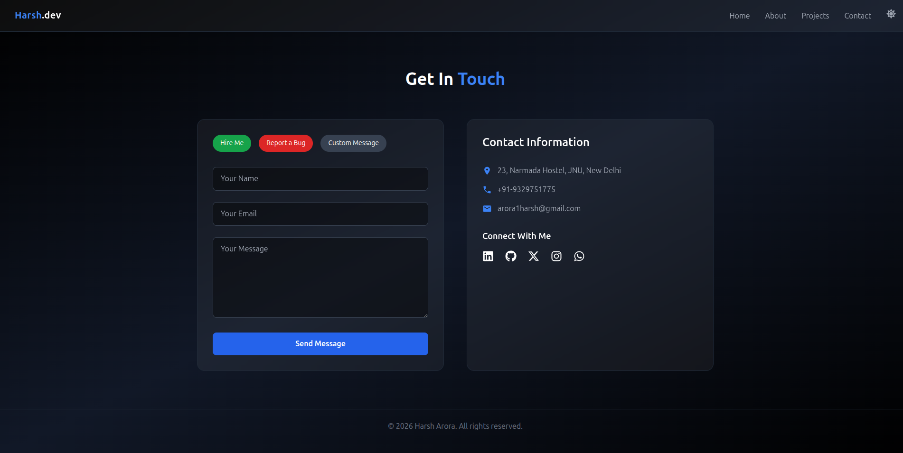

# 🚀 Full-Stack Portfolio Website

A modern, fully responsive full-stack portfolio website built using React, Tailwind CSS, Node.js, Express, and MongoDB.

🌐 **Live Demo:** https://harsh-portfolio-five-beige.vercel.app  
🔗 **GitHub Repository:** https://github.com/arora1harsh/harsh-portfolio  

---

## 📌 Features

- 🌙 Dark / Light Theme Toggle (with persistent preference)
- 🔐 Admin Dashboard with JWT Authentication
- 📝 Dynamic Project Management (Add / Delete Projects)
- 📰 Blog System with Individual Blog Pages
- 📧 Contact Form with Email Integration (Resend API)
- 🎨 Smooth Animations using Framer Motion
- 📱 Fully Responsive Design
- 🌍 Deployed on Vercel (Frontend) & Render (Backend)

---

## 🛠 Tech Stack

### 💻 Frontend
- React.js
- Tailwind CSS
- Framer Motion
- React Router
- Axios
- React Icons

### ⚙ Backend
- Node.js
- Express.js
- MongoDB (Atlas)
- Mongoose
- JWT Authentication
- Resend Email API

### 🚀 Deployment
- Vercel (Frontend)
- Render (Backend)
- MongoDB Atlas (Database)

---

## 🧠 What I Learned

- Implementing secure JWT-based authentication
- Managing environment variables in production
- Debugging SMTP restrictions on cloud platforms
- Integrating third-party email APIs (Resend)
- Handling frontend-backend communication across domains
- Deploying full-stack applications professionally

---

## 📸 Screenshots

### 🏠 Home Page

### 👤 About Page

### 🔐 Admin Dashboard

### 📧 Contact Page

---

